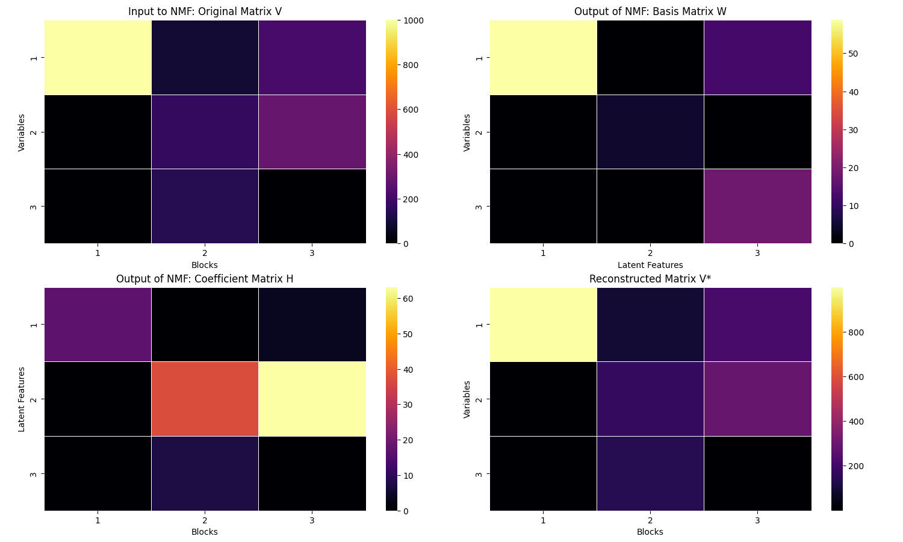

# ChangePointAnalysis

## Projects

### BayesRate.py

This script utilizes Bayesian methods to detect change points in time series data. By applying probabilistic models, it identifies the most probable locations of structural breaks. Note: Currently, BayesRate.py does not take command line arguments and needs to be configured within the script itself.

### GoldSpeed.py

Implements a method to detect changes in the rate of events, providing a detailed analysis of temporal event sequences. This script also needs to be configured within the script itself for input and output paths.

### BB_MatDecomp.py

This script performs the following tasks:

1. **Data Preparation**: Processes multivariate event data, combining timestamps and weights from different variables.
2. **Change Point Detection**: Uses the Bayesian Blocks algorithm to detect common change points across all variables.
3. **Matrix Construction**: Constructs a matrix of weighted rates for each block and variable.
4. **Matrix Decomposition**: Decomposes the matrix into basis and coefficient matrices using Non-Negative Matrix Factorization (NMF).
5. **Visualization**: Visualizes the original matrix, the basis matrix, the coefficient matrix, and the reconstructed matrix using heatmaps.

#### Command-Line Arguments
- `--random_state`: Random state for reproducibility.
- `--nmf_components`: Number of components for NMF.
- `--max_iter`: Maximum number of iterations for NMF.
- `--p0`: False alarm probability for Bayesian Blocks.

## Application to Neural Spike Train (MEA) Data

The script can be adapted for neural spike train analysis, where:
- **Timestamps**: Indicate the time of each spike's maximum.
- **Measurements**: Represent the density and/or amplitude of spikes.

### Key Matrices Interpretation

- **Original Matrix (V)**: Represents the weighted neural activity rates across time blocks.
- **Basis Matrix (W)**: Captures underlying patterns across neurons/channels and latent features representing groups of neurons with similar activity. Columns of W show which neurons form these clusters, highlighting functional neural circuits. 
- **Coefficient Matrix (H)**: Displays how these neural clusters' activity varies over time. Rows of H can identify periods where certin patterns are more prominent, clustering time blocks based on neural activity trends. 
- **Reconstructed Matrix (V*)**: Validates the clustering by approximating the original data, helping to ensure the identified clusters and temporal patterns accurately represent the neural activity. 

## NMF Decomposition Example

The image below illustrates the process of Bayesian Blocks and Non-Negative Matrix Factorization (NMF) applied to the example data. It shows the decomposition of the original data matrix into two component matrices and the reconstruction. 



- **Image Description**: The image demonstrates the decomposition of the original matrix \( V \) into the basis matrix \( W \) and the coefficient matrix \( H \), along with the reconstructed matrix \( V* \).

### Steps for Analysis

1. **Spike Detection and Sorting**: Ensure accurate detection and sorting of spikes.
2. **Data Preprocessing**: Use Bayesian Blocks to find breakpoints in the distribution of spike potentials and encode the blocks categorically to use as weights.
3. **Matrix Construction**: Create the matrix `V`.
4. **Bayesian Blocks**: Identify significant change points and the weighted spike rates between them. 
5. **NMF Analysis**: Perform NMF to extract matrices `W` and `H`.

### How to Use

1. **Load your MEA data**:
   Modify the `load_example_data` function to load your neural spike train data, ensuring measurements are positive reals representing spike density or amplitude, and timestamps indicate spike times.

2. **Run the script**:
   ```bash
   python BB_MatDecomp.py --nmf_components 3 --nmf_max_iter 200 --p0 0.05 --random_state 0

#### Example Usage
```sh
python BB_MatDecomp.py --random_state 0 --nmf_components 3 --max_iter 300 --p0 0.05

Applications

Event Analysis

Goal: Identifying change points in time-series data.

Implementation:

	•	Data Collection: Collect event data over time.
	•	Change Point Detection: Use Bayesian Blocks to identify significant changes in event rates.
	•	Pattern Recognition: Apply NMF to uncover latent structures in the data.

Benefits:

	•	Real-Time Detection: (Trigger BB) Quickly identify significant changes in event patterns.
	•	In-depth Analysis: (BB+NMF) Understand underlying factors contributing to event changes.

Patient Monitoring

Goal: Early detection of changes in patient health status.

Implementation:

	•	Data Collection: Continuously monitor vital signs such as heart rate, blood pressure, and oxygen levels.
	•	Change Point Detection: Use Bayesian Blocks to identify significant shifts in these metrics.
	•	Pattern Recognition: Apply NMF to decompose the data into latent health patterns, distinguishing between normal and abnormal states.

Benefits:

	•	Real-Time Alerts: (Trigger BB) Prompt healthcare providers to potential health issues.
	•	Personalized Care: (Retrospective BB) Tailor interventions based on individual patient data patterns.

Epidemiology

Goal: Understand and control disease spread.

Implementation:

	•	Data Collection: Gather data on infection rates, recoveries, and fatalities across regions and time.
	•	Change Point Detection: Use Bayesian Blocks to detect significant changes in disease trends.
	•	Pattern Recognition: Apply NMF to identify latent factors contributing to the spread, such as demographic or environmental factors.

Benefits:

	•	Timely Interventions: (Trigger BB) Inform public health responses to emerging outbreaks.
	•	Policy Making: (Retrospective BB) Guide resource allocation and preventive measures based on identified patterns.

Neuroscience (MEAs)

Goal: Detect and analyze changes in brain activity over time using Micro-electrode Arrays (MEAs).

Implementation:

	•	Data Collection: Record electrical activity from multiple electrodes over time from MEAs and process this into timestamped and weighted neural spike-train data. 
	•	Change Point Detection: Use Bayesian Blocks to identify significant changes in signal patterns.
	•	Matrix Construction: Construct a matrix where each row corresponds to an electrode (MEA recording) and each column corresponds to a time block defined by detected change points.
	•	Pattern Recognition: Apply NMF to decompose the data matrix into basis and coefficient matrices, uncovering latent neural patterns and components.

Benefits:

	•	Event Detection: (Trigger BB) Identify and localize epileptic seizures, sleep stages, cognitive events, or abnormal neuronal firing patterns.
	•	Pattern Recognition: (Retrospective BB) Discover underlying neural circuits and rhythms.
	•	Feature Extraction: (BB+NMF) Extract meaningful features for further analysis or development of brain-computer interfaces and research into neurological disorders.

Bayesian Blocks: Parameter p0

p0: The false positive rate, which determines the sensitivity of the algorithm to detecting change points.

	•	Increasing p0:
	•	Consequence: Detects fewer change points.
	•	Use Case: Suitable for applications where only significant changes are of interest, reducing the risk of false positives.
	•	Decreasing p0:
	•	Consequence: Detects more change points.
	•	Use Case: Suitable for applications requiring high sensitivity to changes, even if it increases the risk of false positives.
	•	Tuning p0:
	•	Adjust p0 based on the specific requirements of the application to balance sensitivity and false positive rate.
	•	Experiment with different values of p0 to find the optimal setting for your dataset.

Usage

Running BayesRate.py

To detect change points using the Bayesian method, configure the script parameters within the script itself, then run it using Python.

Running GoldSpeed.py

To detect changes in event rates using GoldSpeed, configure the script parameters within the script itself, then run it using Python.

Running BB_MatDecomp.py

To detect common change points and analyze multivariate event data using NMF, run the script using the command line arguments above.

Example Output

The scripts output the detected change points to the terminal and visualize results using Matplotlib.
BayesRate and GoldSpeed both display a piecewise constant representation of weighted poisson event rates and vertical bars indicating breakpoints.
BB_MatDecomp returns the changepoints to the terminal and displays the input matrix to nmf, the decomposition and the reconstruction using matplotlib and seaborn.
